# HMS

JavaFX desktop UI for hospital administration (patients and doctors) backed by MySQL via JDBC.

## Prerequisites

- Java 21 or higher
- Maven 3.6+
- MySQL 8.0+
- `.env` file for database connection credentials

## Database Setup

### 1. Create Database and Schema
```bash
mysql -u root -p < db/schema.sql
```
This creates the `hms` database and all required tables (Patient, Doctor, Department, Appointment, Prescription, PrescriptionItem, MedicalInventory, PatientFeedback).

### 2. Apply Search Indexes
```bash
mysql -u root -p hms < db/search_indexes.sql
```
Adds indexes on frequently searched columns to improve LIKE query performance.

### 3. Load Sample Data
```bash
mysql -u root -p hms < db/sample_data.sql
```
Populates the database with 43 sample records per table for testing and demos.

## Configuration

Create a `.env` file in the project root with your database credentials:
```
DB_URL=jdbc:mysql://localhost:3306/hms
DB_USER=root
DB_PASSWORD=your_password
```

## Running the Application

```bash
mvn javafx:run
```

## JavaFX Interface

The application features a modern tabbed interface for managing hospital data:

### Features
- **Patients Tab**: Search, add, update, and delete patient records with pagination
- **Doctors Tab**: Manage doctor profiles and department assignments
- **Appointments Tab**: Schedule and track patient appointments with date/time selection
- **Prescriptions Tab**: Create and manage prescriptions with medication details
- **Medical Inventory Tab**: Track medication stock levels and details
- **Patient Feedback Tab**: View and manage patient feedback and ratings

### Screenshots

#### Patients Tab
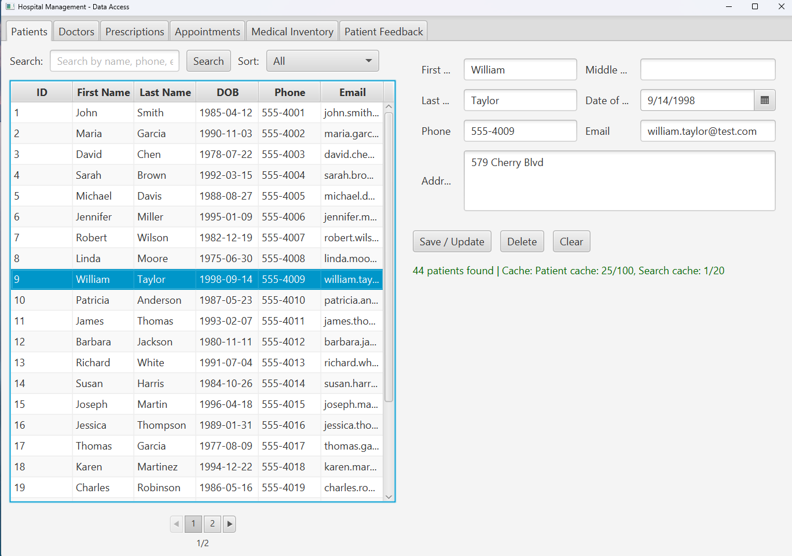

#### Doctors Tab
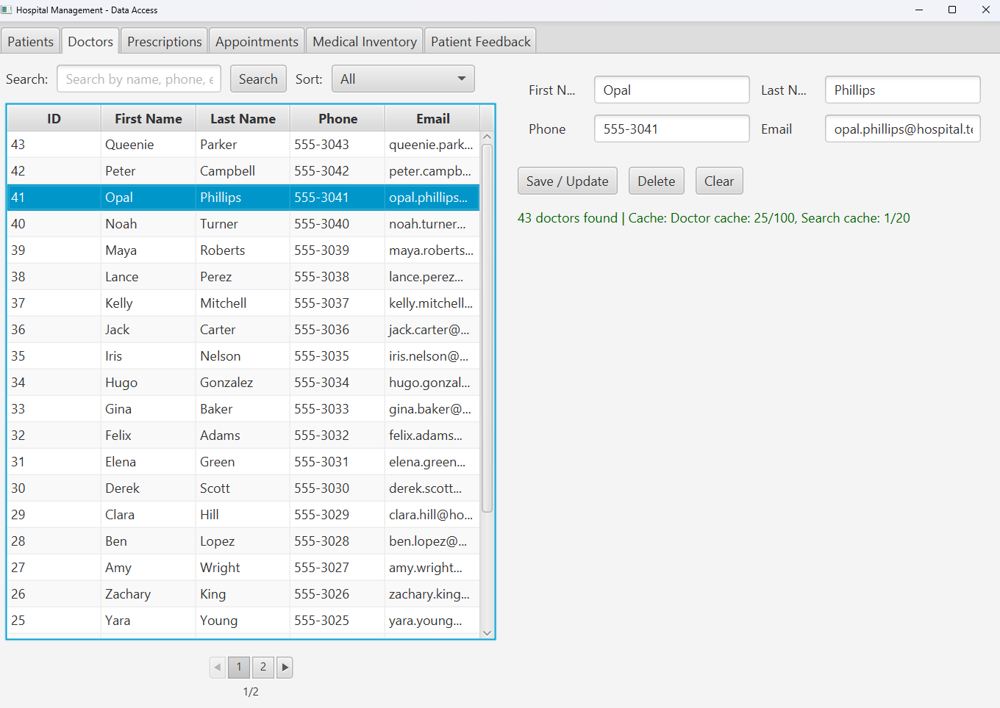

#### Appointments Tab
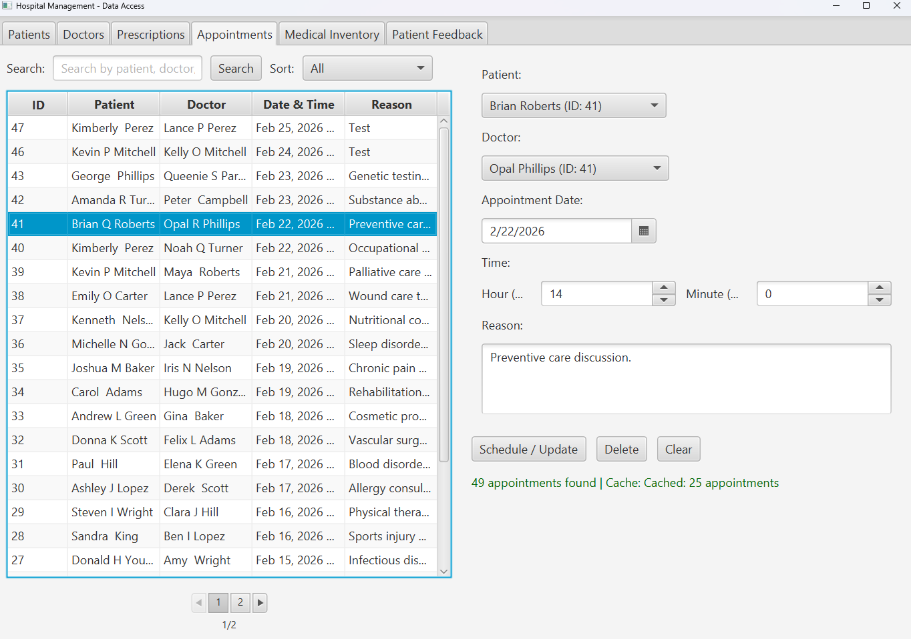

#### Prescriptions Tab
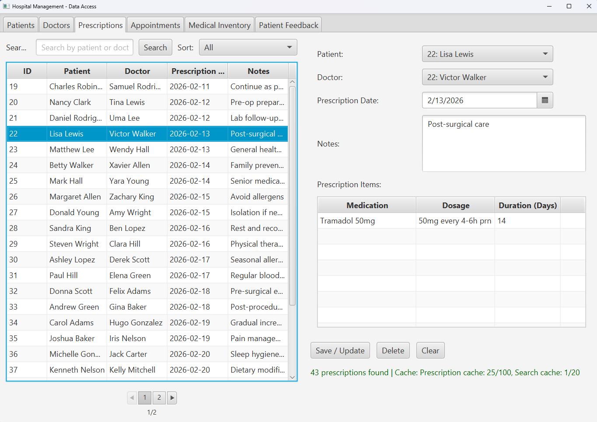

#### Medical Inventory Tab
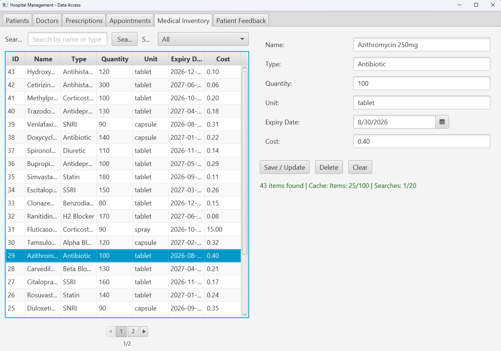

#### Patient Feedback Tab
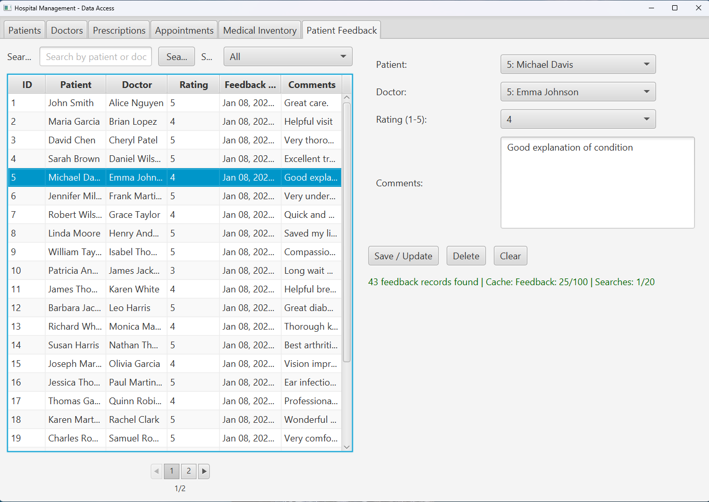

## Documentation

- **ERD**: See [docs/hms-erd.jpeg](docs/hms-erd.jpeg) for the entity-relationship diagram
- **Database Schema**: See [docs/database.md](docs/database.md) for detailed table descriptions, fields, and relationships

## Testing Evidence

Database validation queries from `db/queries.sql` demonstrate correct schema implementation and data relationships.

### Table Population Verification

**Department Table:** All departments successfully created with unique names and phone numbers

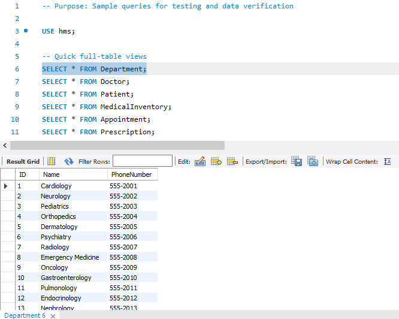

**Doctor Table:** All doctors loaded with proper foreign key references to departments

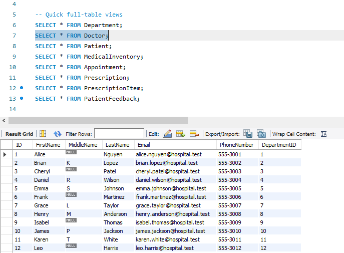

### Relationship Validation

**Appointments with Patient and Doctor Names:** Joined query showing appointments correctly linking patients and doctors with department information. All foreign keys intact.

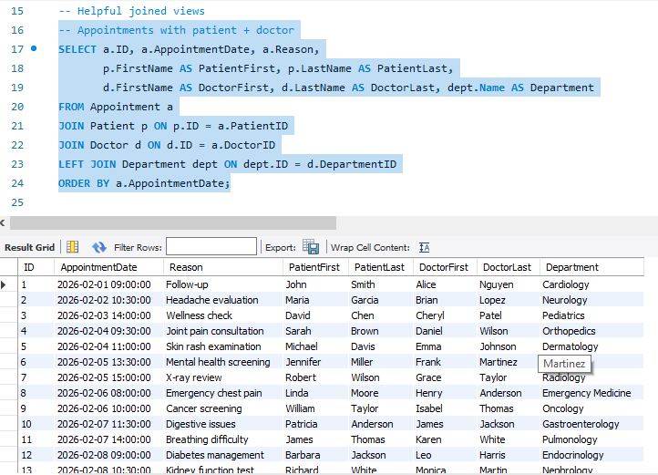

**Prescriptions with Medication Details:** Complex join across Prescription → PrescriptionItem → MedicalInventory tables. Demonstrates proper linking of prescriptions to specific medications with dosage and duration.

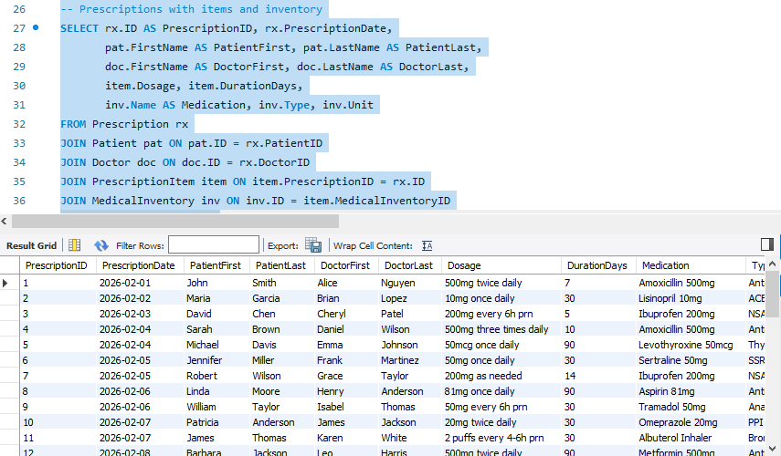

**Patient Feedback with Names:** Patient feedback entries correctly associated with both patient and doctor records, showing ratings (1-5) and comments.

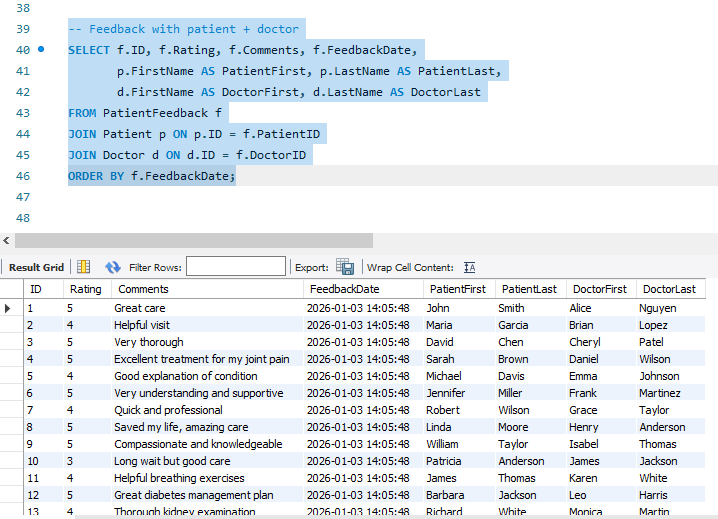


## Contact

For questions or issues regarding this project, please contact the repository owner.
