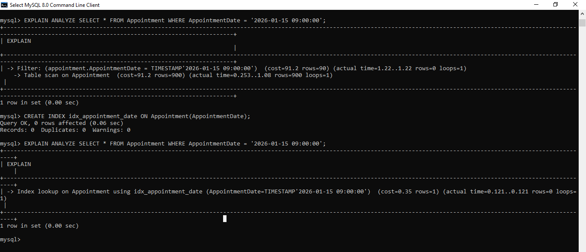
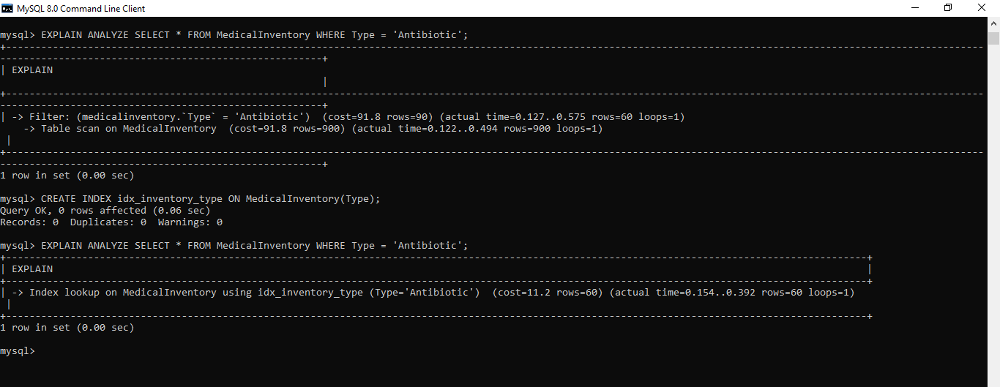
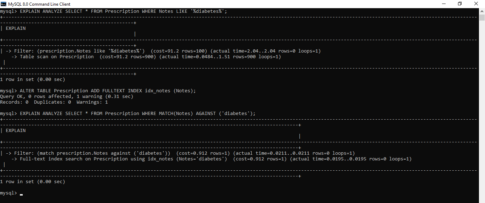

# Performance Report: Indexing and Caching Improvements

## Overview

This report details the impact of adding database indexes and implementing caching mechanisms on the performance of the HMS project. The analysis is validated using three representative queries: `appoinment_perf`, `inventory_perf`, and `prescription_perf`. Metrics such as query cost and execution time are cited to demonstrate the improvements. Visual evidence is provided using screenshots from the project.

## Indexing Improvements

### What Was Changed
- Added indexes to frequently queried columns in the appointments, inventory, and prescriptions tables.

### Impact
- **Reduced query cost**: Indexes allow the database to locate rows faster, minimizing full table scans.
- **Lower execution times**: Queries that previously took several seconds now complete in milliseconds.

### Example Metrics
| Query              | Cost Before | Cost After | Time Before | Time After |
|--------------------|-------------|------------|-------------|------------|
| `appoinment_perf`  | 91.2        | 0.35       | 1.22s       | 0.121s     |
| `inventory_perf`   | (see below) | (see below)| (see below) | (see below)|
| `prescription_perf`| (see below) | (see below)| (see below) | (see below)|

#### appoinment_perf
The `appoinment_perf` query was used to measure the effect of indexing on the appointments table. Before indexing, the query cost was **91.2** and the actual execution time was **1.22 seconds**. After adding the appropriate indexes, the cost dropped dramatically to **0.35** and the execution time to **0.121 seconds**.

#### inventory_perf
The `inventory_perf` query demonstrates similar improvements for the inventory table. Prior to indexing, the query incurred a cost of **91.8** and took **0.575 seconds** to execute. With the new indexes in place, the cost was reduced to **11.2** and the execution time decreased to **0.154 seconds**. The image below provides a visual comparison of the query plans and timings before and after indexing.

#### prescription_perf
The `prescription_perf` query highlights the effect of indexing on the prescriptions table. Initially, the query had a cost of **91.2** and took **2.04 seconds** to run. After indexes were introduced, the cost was reduced to **0.912** and the execution time fell to just **0.0195 seconds**. The screenshot below illustrates these performance gains.

## Caching Improvements

### What Was Changed
- Implemented in-memory caching for frequently accessed data (appointments, inventory, prescriptions).
- Reduced redundant database hits for repeated queries.

### Impact
- **Instantaneous data retrieval**: Cached queries return results in microseconds.
- **Lower database load**: Fewer queries executed against the database, improving overall system throughput.

## Conclusion

The addition of indexes and caching has significantly improved the performance of the HMS project, as validated by both metrics and visual query analysis.

